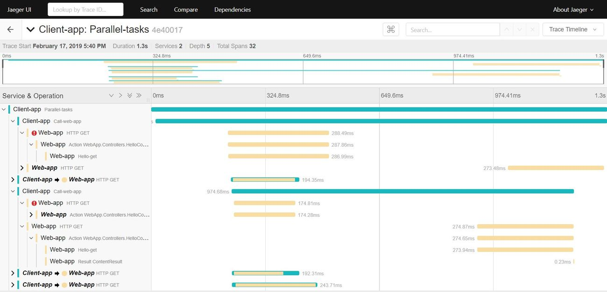

# Playing with Distributed Tracing

This is a small .NET Core demo application to try out distributed tracing using `Jaeger` and `OpenTracing`.

[Separate branch](https://github.com/19balazs86/PlayingWithDistributedTracing/tree/netcoreapp2.2) with the .NET Core 2.2 version.

##### What is distributed tracing
> Distributed tracing is a method used to profile and monitor applications, especially those built using a microservices architecture. Distributed tracing helps pinpoint where failures occur and what causes poor performance. Distributed tracing is a method used to profile and monitor applications, especially those built using a microservices architecture. Distributed tracing helps pinpoint where failures occur and what causes poor performance.

The solution contains 3 projects.

##### Common
- Tracer initializer.
- Some extension methods for `ITracer`, `ISpan` in order to make the life easier.

##### WebApp
- HelloController: The action returns with a random response (200, 400, 500...) to simulate real life cases (good or bad response).

##### ClientApp
- Console application.
- Initiate HTTP calls to the WebApp.
- Inject the tracing information in to the HTTP header.
- Using [Polly](https://github.com/App-vNext/Polly) to retry and cancel the call.

#### Resources
- [Jaeger](https://www.jaegertracing.io): Open-source, end-to-end distributed tracing.
- [Download Jaeger](https://www.jaegertracing.io/download) -> Run: jaeger-all-in-one.exe -> http://localhost:16686.
- [OpenTracing](https://opentracing.io): Vendor-neutral APIs and instrumentation for distributed tracing.
- GitHub: [C# Client for Jaeger](https://github.com/jaegertracing/jaeger-client-csharp).
- GitHub:[OpenTracing API for .NET](https://github.com/opentracing/opentracing-csharp).
- GitHub: [C# Jaeger-OpenTracing Tutorials](https://github.com/yurishkuro/opentracing-tutorial/tree/master/csharp).
- GitHub: [Opentracing-contrib](https://github.com/opentracing-contrib/csharp-netcore).

##### Screenshot after running the code

